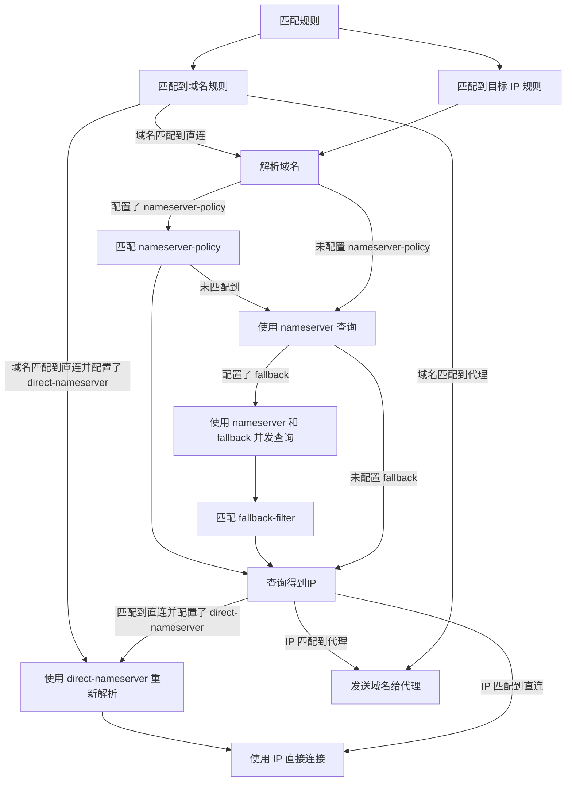
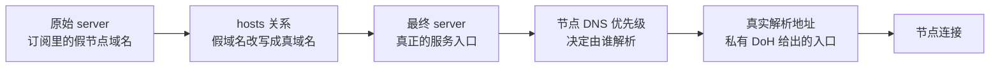

::alert
#default
以下规则集都以 [MetaCubeX/meta-rules-dat](https://github.com/MetaCubeX/meta-rules-dat/) 官方的规则集仓库为例。
::

~~我的记忆力已经有点不太好了，这篇文章主要是为了写为什么这样做。~~ 本文我经常写一会想一会，生怕 :tip[漏了内容]{tip="后面可能还要修修补补💦"}，所以写得有点长。但基本是我对配置的理解和他人的总结，所讲的内容不是配置的全部，完整的可以前往 [MyClash/Config/myclash.yaml](https://github.com/Mugzx/MyClash/blob/main/Config/myclash.yaml) 查看。

从写这篇文章开始我就觉得会有一定争论产生，如果是因为这样影响到你了，看到这就该离开了就好。当初写出来的时候就压根没在意宣传，而是在意解法，要评判欢迎把页尾部分的加进去。

## DNS

与 DNS 分流有关的主要是最后 5 行，以及 DNS 解析的流程，搭配 [解析流程 - 虚空终端 Docs](https://wiki.metacubex.one/config/dns/diagram/#_3) 图文会更清晰一些。

```yaml
chinaDNS: &chinaDNS ['https://dns.alidns.com/dns-query', 'https://doh.pub/dns-query']
foreignDNS: &foreignDNS ['https://dns.cloudflare.com/dns-query#默认代理', 'https://dns.google/dns-query#默认代理']

dns:
  enable: true
  cache-algorithm: arc
  enhanced-mode: fake-ip
  fake-ip-range: 198.18.0.1/16
  fake-ip-range6: fdfe:dcba:9876::1/64
  fake-ip-filter: ['rule-set:private', 'rule-set:fakeip_filter', 'rule-set:geolocation-cn']
  use-hosts: true
  use-system-hosts: true
  nameserver: *foreignDNS
  nameserver-policy:
    'rule-set:cn': *chinaDNS
  proxy-server-nameserver: *chinaDNS
  direct-nameserver: *chinaDNS
```

这些是基本的 DNS 解析配置字段，在本文后面还会再出现。



- `default-nameserver` 是「默认解析 DNS 的 DNS」解析服务器，不填也会有内核进行处理。
- `nameserver` 是「默认的 DNS」解析服务器，在这里需要配置兜底的国外 DNS。
- `nameserver-policy` 是「指定默认的 DNS」解析服务器，在这里配置「国内域名」规则集使用国内 DNS。
- `proxy-server-nameserver` 是「代理节点的 DNS」解析服务器，不填会遵循 `nameserver` 的设置，但这样会使用国外 DNS，遇到「先有鸡还是先有蛋」问题，所以需要与 `nameserver-policy` 一样使用国内 DNS。
- `direct-nameserver` 是「直连的 DNS」解析服务器，如果按照上文一样的配置，即使去除最终的解析结果也不会有 :tip[太大变化]{tip="对目标 IP 规则来说，反而可以说减少一次 DNS 解析"}。
  - 但从解析流程图上看，其实增加了域名规则的解析过程，所以还是更推荐填写。

## hosts

### 域名映射

上文没有配置 `default-nameserver`，就是因为已经在 hosts 字段里做了防污染——把 DNS 服务器域名直接映射到对应 IP。

```yaml
hosts:
  'dns.alidns.com': ['223.5.5.5', '223.6.6.6']
  'doh.pub': ['1.12.12.12', '120.53.53.53']
  'dns.cloudflare.com': ['1.1.1.1', '1.0.0.1']
  'dns.google': ['8.8.8.8', '8.8.4.4']
```

不过 :tip[加上]{tip="我有强迫症不想看到一行 IP 在那"} 这字段也是可以的。

### Google Play 商店无法下载

如果不想折腾路由规则，用 hosts 就是最简单的方式。

```yaml
hosts:
  'services.googleapis.cn': 'services.googleapis.com'
```

成因是该域名被解析为国内 IP，只要让 `services.googleapis.cn` 走代理就没有问题。

### B 站 PCDN

屏蔽 B 站的视频和直播 PCDN，没什么好说的。

```yaml
hosts:
  '+.mcdn.bilivideo.com': ['0.0.0.0']
  '+.mcdn.bilivideo.cn': ['0.0.0.0']
  '+.edge.mountaintoys.cn': ['0.0.0.0']
  '+.h2.smtcdns.net': ['0.0.0.0']
```

后面两条来自 [the1812/Bilibili-Evolved#5438](https://github.com/the1812/Bilibili-Evolved/discussions/5438) 与 [MBGA#272113](https://greasyfork.org/zh-CN/scripts/415714-make-bilibili-great-again/discussions/272113)。

## 规则与规则集

::alert{type="warning"}
#default
GeoData 臃肿的体积对软、硬路由这类设备十分甚至九分的不友好，更推荐用 `RULE-SET` 按需添加，参考 [FAQ · nikkinikki-org/OpenWrt-nikki Wiki](https://github.com/nikkinikki-org/OpenWrt-nikki/wiki/FAQ#%E8%87%AA%E5%8A%A8%E4%B8%8B%E8%BD%BD%E9%9D%A2%E6%9D%BFgeox%E6%95%B0%E6%8D%AE%E5%A4%B1%E8%B4%A5%E6%88%91%E6%83%B3%E6%89%8B%E5%8A%A8%E4%B8%8A%E4%BC%A0%E9%9D%A2%E7%89%88geox-%E6%95%B0%E6%8D%AE%E5%BA%93%E5%BA%94%E8%AF%A5%E6%80%8E%E4%B9%88%E5%81%9A)。
::

规则大致可以分为**三类两种**：三类指的是 [规则集合内容 - 虚空终端 Docs](https://wiki.metacubex.one/config/rule-providers/content/)，两种指的是域名规则和目标 IP 规则。

### 关于排序

更精细化的分流需要把**子规则排在父规则之前**。

*「规则将按照从上到下的顺序匹配，列表顶部的规则优先级高于其底下的规则。」*

下文的 `cn_ip` 放在 `MATCH` 规则之前，可以避免多余的 DNS 解析。

### no-resolve

*「如在更早的匹配中触发了 dns 解析，则依旧会匹配到添加了 `no-resolve` 选项的 `目标IP` 类规则。」*

另外，我参考了 [路由规则 - 虚空终端 Docs](https://wiki.metacubex.one/config/rules/#no-resolve) 对 `no-resolve` 的描述：

- 一旦触发了 DNS 解析，后续的规则中，域名及其解析出的 IP 都会参与匹配。

- 对于 DNS 记录被修改、或被污染为 `0.0.0.0` 或 `127.0.0.1` 的域名，一旦触发解析，就可能让它走直连。

- 目标 IP 规则除了直接匹配 IP 段，也会尝试把域名解析成 IP 再匹配，所以要用 `no-resolve` 阻止它触发解析。

总之可以这样理解：如果在 `no-resolve` 之前已经触发了 DNS 解析，那么 `no-resolve` 就白写了——解析结果已经产生，会影响后续规则的命中。

### geolocation

`geolocation-!cn` 里包含 `gfw`，`geolocation-cn` 比「国内域名」规则集更准确，后者比较宽泛，更适合用来做 DNS 分流而不是路由分流。

```yaml
rules:
  - RULE-SET,geolocation-cn,本地直连
  - RULE-SET,geolocation-!cn,默认代理
  - RULE-SET,cn_ip,本地直连
  - match,漏网之鱼
```

~~如果有和 `geolocation-cn` 一样定位但更全面的规则，`cn_ip` 加上 `no-resolve` 也不是不行。~~

### @ 和 !

这套命名太容易让人迷惑了，上游传下来后还很少有说明。

- `-cn` 属于中国大陆。
- `-!cn` 不属于中国大陆。
- `-@cn` 一般在中国大陆有接入点。
- `-@!cn` 一般在中国大陆没有接入点。
- `@ads` 被用于展示广告。

具体可见 [v2fly/domain-list-community#91](https://github.com/v2fly/domain-list-community/issues/91) 与 [v2fly/domain-list-community#notice](https://github.com/v2fly/domain-list-community#notice)。

`-cn@cn`、`-cn@!cn`、`-!cn@cn`、`-!cn@!cn` 四条我觉得怎么理解都有歧义，大致结合上面的基础标签看就好。

- `-cn@!cn` 这类规则在 [v2fly/domain-list-community#390](https://github.com/v2fly/domain-list-community/issues/390#issuecomment-3649035102) 已移除。
- `-!cn@cn` 在某些规则集中这个可能等同于上文的 `@cn`。

`cn_ip` 会根据 `nameserver-policy` 的 `'rule-set:cn': *chinaDNS` 解析国内域名规则集，这里不能用 `no-resolve`——前面的铺垫都是为了最后的兜底，如果这里不做 DNS 解析，就变成纯目标 IP 匹配了。

### 屏蔽国外 QUIC，但排除国内

作用写在小标题上了。这条规则略有争议，主要是它并没有完整地放行国内流量。

```yaml
rules:
  - AND,((NETWORK,UDP),(DST-PORT,443),(NOT,((OR,((RULE-SET,geolocation-cn),(RULE-SET,cn_ip,no-resolve)))))),REJECT
```

但多数时候，规则所放行的就足够使用了。

## 联机

我玩的联机游戏不多，但遇到的联机方式基本都是走 `IP:Port` 加高位端口的 UDP 协议，也有用域名连接的《Minecraft》。

《泰坦陨落 2》用 AWS，《饥荒》用 Beeline Home，《星露谷物语》用 Valve 等服务器；在覆盖面上，GeoIP 不如 ASN 覆盖得全，它只覆盖主流、常见的 IP 段，一些小众 IP 段就无法用 GeoIP 控制分流，此时用 ASN 是更合适的选择。

## 节点线路分配

::alert
#default
这里默认你是直接使用自己写的配置，并且在使用多个代理提供商。
::

中转和专线的一线代理提供商分配代理节点线路的方式大致有两种：私有 DNS 和 hosts 真假映射，也有同时使用两种的。它们用这两种方式来决定节点走哪条线路；如果使用公共 DNS，可能被分配到较差的线路，甚至节点不可用。

### 仅私有 DNS

常见 `nameserver-policy` 或者 `proxy-server-nameserver` 字段来指定域名分配线路。

```yaml
dns:
  enable: true
  use-hosts: true
  nameserver:
    - 223.5.5.5
    - 114.114.144.114
    - 1.1.1.1
    - 8.8.8.8
  nameserver-policy:
    - # 这里会是私有 DNS
  proxy-server-nameserver:
    - # 这里也会是私有 DNS
```

把含有私有 DNS 部分 **指定** 出，用 `proxy-server-nameserver-policy` 针对指定域名单独指定解析来源。

### 仅真假映射

::alert
我只遇到过私有 DNS 的配置，对映射的处理没什么把握，不一定可用。
::

`proxy-server-nameserver` 一般搭配 `udp://127.0.0.1:1053` 以及 hosts 真假出现。

```yaml
dns:
  enable: true
  listen: 127.0.0.1:1053
  use-hosts: true
  nameserver:
    - 223.5.5.5
    - 114.114.144.114
    - 1.1.1.1
    - 8.8.8.8
  proxy-server-nameserver:
    - udp://127.0.0.1:1053

hosts:
  POSSIBLE_BAD_RESULT_A: REAL_SERVICE_ENTRY_A
  POSSIBLE_BAD_RESULT_B: REAL_SERVICE_ENTRY_B
  POSSIBLE_BAD_RESULT_C: REAL_SERVICE_ENTRY_C
```

指定节点域名用 `udp://127.0.0.1:1053` 解析。

```yaml
proxy-server-nameserver-policy:
  +.test.com:
    - udp://127.0.0.1:1053
```

不过在 mihomo 中可以使用 `proxy-providers.override.override-expr` 更优雅地解决。

::folding
#title
用 `proxy-providers.override.override-expr` 处理
#default

另有一种是自己没写 `proxy-server-nameserver`，复制机场配置即可的。来源为 [Telegram: Contact @kuromis_xiaoxi](https://t.me/kuromis_xiaoxi)。

```yaml
proxy-providers:
  provider1:
    type: http
    url: "http://test.com"
    path: ./proxy_providers/provider1.yaml
    override:
      override-expr:
          - '(select(.server == "A") | .server) = "B"'
```

A 和 B 分别为 hosts 值左侧以及右侧域名，也可能是 IP。
::

### 混合分配的代理

前面说过有同时使用两种方式的代理提供商。



二者大致是样在使用的，解决方法同上述结合可得。

## 健康检查测试地址

选择标准很简单：任播（Anycast），国内测速不超时、延迟别太高即可。

代理组我用 Google 的 `connectivitycheck.gstatic.com`，而直连组则换成了华为的 `connectivitycheck.platform.hicloud.com`。

## 一些过时配置

`fallback`、`redir-host`、`sniffer` 这三个配置我了解不多，只知道它们大多存在一些问题或已经过时，现在不再推荐使用。
